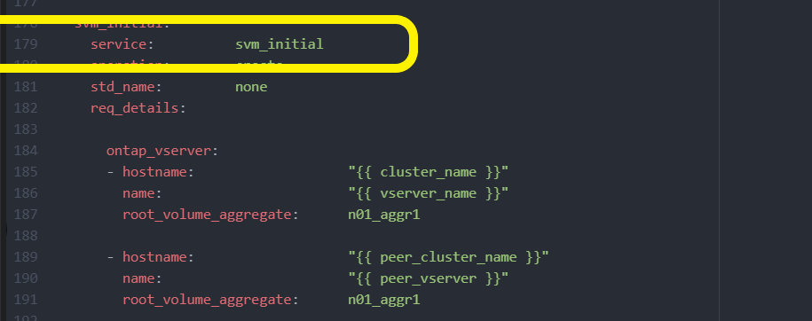

= Implante o cluster do ONTAP usando a solução
:hardbreaks:
:allow-uri-read: 
:nofooter: 
:icons: font
:linkattrs: 
:imagesdir: ../media/

[role="lead"]
Após concluir a preparação e o Planejamento, você estará pronto para usar a solução ONTAP day 0/1 para configurar rapidamente um cluster do ONTAP usando o Ansible.

A qualquer momento durante as etapas desta seção, você pode optar por testar uma solicitação em vez de executá-la. Para testar uma solicitação, altere o `site.yml` manual na linha de comando para `logic.yml`.

NOTE: A `docs/tutorial-requests.txt` localização contém a versão final de todos os pedidos de assistência utilizados durante este procedimento. Se tiver dificuldade em executar uma solicitação de serviço, você pode copiar a solicitação relevante do `tutorial-requests.txt` arquivo para `playbooks/inventory/group_vars/all/tutorial-requests.yml` o local e modificar os valores codificados conforme necessário (endereço IP, nomes agregados, etc.). Em seguida, você deve ser capaz de executar com sucesso a solicitação.

== Antes de começar

* Tenha o Ansible instalado.
* Você precisa ter baixado a solução do dia 0/1 do ONTAP e extraído a pasta para o local desejado no nó de controle do Ansible.
* O estado do sistema ONTAP deve atender aos requisitos e você precisa ter as credenciais necessárias.
* Você deve ter concluído todas as tarefas necessárias descritas na link:ontap-day01-prepare.html["Prepare-se"]seção.

NOTE: Os exemplos dessa solução usam "Cluster_01" e "Cluster_02" como os nomes dos dois clusters. É necessário substituir esses valores pelos nomes dos clusters no ambiente.

== Etapa 1: Configuração inicial do cluster

Neste estágio, você deve executar algumas etapas iniciais de configuração do cluster.

.Passos
. Navegue até o `playbooks/inventory/group_vars/all/tutorial-requests.yml` local e reveja a `cluster_initial` solicitação no arquivo. Faça as alterações necessárias para o seu ambiente.
. Crie um arquivo `logic-tasks` na pasta para a solicitação de serviço. Por exemplo, crie um arquivo `cluster_initial.yml` chamado .
+
Copie as seguintes linhas para o novo arquivo:

+
[source, cli]
----
- name: Validate required inputs
  ansible.builtin.assert:
    that:
    - service is defined

- name: Include data files
  ansible.builtin.include_vars:
    file:   "{{ data_file_name }}.yml"
  loop:
  - common-site-stds
  - user-inputs
  - cluster-platform-stds
  - vserver-common-stds
  loop_control:
    loop_var:    data_file_name

- name: Initial cluster configuration
  set_fact:
    raw_service_request:
----
. Defina a `raw_service_request` variável.
+
Você pode usar uma das seguintes opções para definir a `raw_service_request` variável no `cluster_initial.yml` arquivo que você criou na `logic-tasks` pasta:

+
** *Opção 1*: Defina manualmente a `raw_service_request` variável.
+
Abra o `tutorial-requests.yml` arquivo usando um editor e copie o conteúdo da linha 11 para a linha 165. Cole o conteúdo sob a `raw service request` variável no novo `cluster_initial.yml` arquivo, como mostrado nos exemplos a seguir:

+
image::../media/cluster_initial_line.png[Imagem da linha de arquivo para copiar]

+
.Mostrar exemplo
[%collapsible]
====
Ficheiro de exemplo `cluster_initial.yml`:

[listing]
----
- name: Validate required inputs
  ansible.builtin.assert:
    that:
    - service is defined

- name: Include data files
  ansible.builtin.include_vars:
    file:   "{{ data_file_name }}.yml"
  loop:
  - common-site-stds
  - user-inputs
  - cluster-platform-stds
  - vserver-common-stds
  loop_control:
    loop_var:    data_file_name

- name: Initial cluster configuration
  set_fact:
    raw_service_request:
     service:          cluster_initial
     operation:         create
     std_name:           none
     req_details:

      ontap_aggr:
      - hostname:                   "{{ cluster_name }}"
        disk_count:                 24
        name:                       n01_aggr1
        nodes:                      "{{ cluster_name }}-01"
        raid_type:                  raid4

      - hostname:                   "{{ peer_cluster_name }}"
        disk_count:                 24
        name:                       n01_aggr1
        nodes:                      "{{ peer_cluster_name }}-01"
        raid_type:                  raid4

      ontap_license:
      - hostname:                   "{{ cluster_name }}"
        license_codes:
        - XXXXXXXXXXXXXXAAAAAAAAAAAAAA
        - XXXXXXXXXXXXXXAAAAAAAAAAAAAA
        - XXXXXXXXXXXXXXAAAAAAAAAAAAAA
        - XXXXXXXXXXXXXXAAAAAAAAAAAAAA
        - XXXXXXXXXXXXXXAAAAAAAAAAAAAA
        - XXXXXXXXXXXXXXAAAAAAAAAAAAAA
        - XXXXXXXXXXXXXXAAAAAAAAAAAAAA
        - XXXXXXXXXXXXXXAAAAAAAAAAAAAA
        - XXXXXXXXXXXXXXAAAAAAAAAAAAAA
        - XXXXXXXXXXXXXXAAAAAAAAAAAAAA
        - XXXXXXXXXXXXXXAAAAAAAAAAAAAA
        - XXXXXXXXXXXXXXAAAAAAAAAAAAAA
        - XXXXXXXXXXXXXXAAAAAAAAAAAAAA
        - XXXXXXXXXXXXXXAAAAAAAAAAAAAA
        - XXXXXXXXXXXXXXAAAAAAAAAAAAAA
        - XXXXXXXXXXXXXXAAAAAAAAAAAAAA
        - XXXXXXXXXXXXXXAAAAAAAAAAAAAA
        - XXXXXXXXXXXXXXAAAAAAAAAAAAAA
        - XXXXXXXXXXXXXXAAAAAAAAAAAAAA
        - XXXXXXXXXXXXXXAAAAAAAAAAAAAA
        - XXXXXXXXXXXXXXAAAAAAAAAAAAAA
        - XXXXXXXXXXXXXXAAAAAAAAAAAAAA
        - XXXXXXXXXXXXXXAAAAAAAAAAAAAA
        - XXXXXXXXXXXXXXAAAAAAAAAAAAAA
        - XXXXXXXXXXXXXXAAAAAAAAAAAAAA
        - XXXXXXXXXXXXXXAAAAAAAAAAAAAA
        - XXXXXXXXXXXXXXAAAAAAAAAAAAAA
        - XXXXXXXXXXXXXXAAAAAAAAAAAAAA
        - XXXXXXXXXXXXXXAAAAAAAAAAAAAA
        - XXXXXXXXXXXXXXAAAAAAAAAAAAAA
        - XXXXXXXXXXXXXXAAAAAAAAAAAAAA

    - hostname:                   "{{ peer_cluster_name }}"
      license_codes:
        - XXXXXXXXXXXXXXAAAAAAAAAAAAAA
        - XXXXXXXXXXXXXXAAAAAAAAAAAAAA
        - XXXXXXXXXXXXXXAAAAAAAAAAAAAA
        - XXXXXXXXXXXXXXAAAAAAAAAAAAAA
        - XXXXXXXXXXXXXXAAAAAAAAAAAAAA
        - XXXXXXXXXXXXXXAAAAAAAAAAAAAA
        - XXXXXXXXXXXXXXAAAAAAAAAAAAAA
        - XXXXXXXXXXXXXXAAAAAAAAAAAAAA
        - XXXXXXXXXXXXXXAAAAAAAAAAAAAA
        - XXXXXXXXXXXXXXAAAAAAAAAAAAAA
        - XXXXXXXXXXXXXXAAAAAAAAAAAAAA
        - XXXXXXXXXXXXXXAAAAAAAAAAAAAA
        - XXXXXXXXXXXXXXAAAAAAAAAAAAAA
        - XXXXXXXXXXXXXXAAAAAAAAAAAAAA
        - XXXXXXXXXXXXXXAAAAAAAAAAAAAA
        - XXXXXXXXXXXXXXAAAAAAAAAAAAAA
        - XXXXXXXXXXXXXXAAAAAAAAAAAAAA
        - XXXXXXXXXXXXXXAAAAAAAAAAAAAA
        - XXXXXXXXXXXXXXAAAAAAAAAAAAAA
        - XXXXXXXXXXXXXXAAAAAAAAAAAAAA
        - XXXXXXXXXXXXXXAAAAAAAAAAAAAA
        - XXXXXXXXXXXXXXAAAAAAAAAAAAAA
        - XXXXXXXXXXXXXXAAAAAAAAAAAAAA
        - XXXXXXXXXXXXXXAAAAAAAAAAAAAA
        - XXXXXXXXXXXXXXAAAAAAAAAAAAAA
        - XXXXXXXXXXXXXXAAAAAAAAAAAAAA
        - XXXXXXXXXXXXXXAAAAAAAAAAAAAA
        - XXXXXXXXXXXXXXAAAAAAAAAAAAAA
        - XXXXXXXXXXXXXXAAAAAAAAAAAAAA
        - XXXXXXXXXXXXXXAAAAAAAAAAAAAA

    ontap_motd:
    - hostname:                   "{{ cluster_name }}"
      vserver:                    "{{ cluster_name }}"
      message:                    "New MOTD"

    - hostname:                   "{{ peer_cluster_name }}"
      vserver:                    "{{ peer_cluster_name }}"
      message:                    "New MOTD"

    ontap_interface:
    - hostname:                   "{{ cluster_name }}"
      vserver:                    "{{ cluster_name }}"
      interface_name:             ic01
      role:                       intercluster
      address:                    10.0.0.101
      netmask:                    255.255.255.0
      home_node:                  "{{ cluster_name }}-01"
      home_port:                  e0c
      ipspace:                    Default
      use_rest:                   never

    - hostname:                   "{{ cluster_name }}"
      vserver:                    "{{ cluster_name }}"
      interface_name:             ic02
      role:                       intercluster
      address:                    10.0.0.101
      netmask:                    255.255.255.0
      home_node:                  "{{ cluster_name }}-01"
      home_port:                  e0c
      ipspace:                    Default
      use_rest:                   never

    - hostname:                   "{{ peer_cluster_name }}"
      vserver:                    "{{ peer_cluster_name }}"
      interface_name:             ic01
      role:                       intercluster
      address:                    10.0.0.101
      netmask:                    255.255.255.0
      home_node:                  "{{ peer_cluster_name }}-01"
      home_port:                  e0c
      ipspace:                    Default
      use_rest:                   never

    - hostname:                   "{{ peer_cluster_name }}"
      vserver:                    "{{ peer_cluster_name }}"
      interface_name:             ic02
      role:                       intercluster
      address:                    10.0.0.101
      netmask:                    255.255.255.0
      home_node:                  "{{ peer_cluster_name }}-01"
      home_port:                  e0c
      ipspace:                    Default
      use_rest:                   never

    ontap_cluster_peer:
    - hostname:                   "{{ cluster_name }}"
      dest_cluster_name:          "{{ peer_cluster_name }}"
      dest_intercluster_lifs:     "{{ peer_lifs }}"
      source_cluster_name:        "{{ cluster_name }}"
      source_intercluster_lifs:   "{{ cluster_lifs }}"
      peer_options:
        hostname:                 "{{ peer_cluster_name }}"

----
====
** *Opção 2*: Use um modelo Jinja para definir a solicitação:
+
Você também pode usar o seguinte formato de modelo Jinja para obter o `raw_service_request` valor.

+
`raw_service_request:      "{{ cluster_initial }}"`

. Execute a configuração inicial do cluster para o primeiro cluster:
+
[source, cli]
----
ansible-playbook -i inventory/hosts site.yml -e cluster_name=<Cluster_01>
----
+
Verifique se não existem erros antes de prosseguir.

. Repita o comando para o segundo cluster:
+
[source, cli]
----
ansible-playbook -i inventory/hosts site.yml -e cluster_name=<Cluster_02>
----
+
Verifique se não há erros para o segundo cluster.

+
Ao rolar para cima em direção ao início da saída do Ansible, você verá a solicitação que foi enviada para a estrutura, como mostrado no exemplo a seguir:

+
.Mostrar exemplo
[%collapsible]
====
[listing]
----
TASK [Show the raw_service_request] ************************************************************************************************************
ok: [localhost] => {
    "raw_service_request": {
        "operation": "create",
        "req_details": {
            "ontap_aggr": [
                {
                    "disk_count": 24,
                    "hostname": "Cluster_01",
                    "name": "n01_aggr1",
                    "nodes": "Cluster_01-01",
                    "raid_type": "raid4"
                }
            ],
            "ontap_license": [
                {
                    "hostname": "Cluster_01",
                    "license_codes": [
                        "XXXXXXXXXXXXXXXAAAAAAAAAAAA",
                        "XXXXXXXXXXXXXXAAAAAAAAAAAAA",
                        "XXXXXXXXXXXXXXAAAAAAAAAAAAA",
                        "XXXXXXXXXXXXXXAAAAAAAAAAAAA",
                        "XXXXXXXXXXXXXXAAAAAAAAAAAAA",
                        "XXXXXXXXXXXXXXAAAAAAAAAAAAA",
                        "XXXXXXXXXXXXXXAAAAAAAAAAAAA",
                        "XXXXXXXXXXXXXXAAAAAAAAAAAAA",
                        "XXXXXXXXXXXXXXAAAAAAAAAAAAA",
                        "XXXXXXXXXXXXXXAAAAAAAAAAAAA",
                        "XXXXXXXXXXXXXXAAAAAAAAAAAAA",
                        "XXXXXXXXXXXXXXAAAAAAAAAAAAA",
                        "XXXXXXXXXXXXXXAAAAAAAAAAAAA",
                        "XXXXXXXXXXXXXXAAAAAAAAAAAAA",
                        "XXXXXXXXXXXXXXAAAAAAAAAAAAA",
                        "XXXXXXXXXXXXXXAAAAAAAAAAAAA",
                        "XXXXXXXXXXXXXXAAAAAAAAAAAAA",
                        "XXXXXXXXXXXXXXAAAAAAAAAAAAA",
                        "XXXXXXXXXXXXXXAAAAAAAAAAAAA",
                        "XXXXXXXXXXXXXXAAAAAAAAAAAAA",
                        "XXXXXXXXXXXXXXAAAAAAAAAAAAA",
                        "XXXXXXXXXXXXXXAAAAAAAAAAAAA",
                        "XXXXXXXXXXXXXXAAAAAAAAAAAAA",
                        "XXXXXXXXXXXXXXAAAAAAAAAAAAA",
                        "XXXXXXXXXXXXXXAAAAAAAAAAAAA",
                        "XXXXXXXXXXXXXXAAAAAAAAAAAAA",
                        "XXXXXXXXXXXXXXAAAAAAAAAAAAA",
                        "XXXXXXXXXXXXXXAAAAAAAAAAAAA",
                        "XXXXXXXXXXXXXXAAAAAAAAAAAAA",
                        "XXXXXXXXXXXXXXAAAAAAAAAAAAA",
                        "XXXXXXXXXXXXXXAAAAAAAAAAAAA",
                        "XXXXXXXXXXXXXXAAAAAAAAAAAAA",
                        "XXXXXXXXXXXXXXAAAAAAAAAAAAA",
                        "XXXXXXXXXXXXXXAAAAAAAAAAAAA"
                    ]
                }
            ],
            "ontap_motd": [
                {
                    "hostname": "Cluster_01",
                    "message": "New MOTD",
                    "vserver": "Cluster_01"
                }
            ]
        },
        "service": "cluster_initial",
        "std_name": "none"
    }
}
----
====
. Faça login em cada instância do ONTAP e verifique se a solicitação foi bem-sucedida.

== Etapa 2: Configurar os LIFs entre clusters

Agora você pode configurar as LIFs entre clusters adicionando as definições de LIF à `cluster_initial` solicitação e definindo o `ontap_interface` microservice.

A definição do serviço e a solicitação trabalham em conjunto para determinar a ação:

* Se você fornecer uma solicitação de serviço para um microservice que não esteja nas definições de serviço, a solicitação não será executada.
* Se você fornecer uma solicitação de serviço com um ou mais microsserviços definidos nas definições de serviço, mas omitido da solicitação, a solicitação não será executada.

O `execution.yml` manual de estratégia avalia a definição do serviço digitalizando a lista de microsserviços na ordem listada:

* Se houver uma entrada na solicitação com uma chave de dicionário que corresponda à `args` entrada contida nas definições de microservices, a solicitação será executada.
* Se não houver nenhuma entrada correspondente na solicitação de serviço, a solicitação será ignorada sem erro.

.Passos
. Navegue até o `cluster_initial.yml` arquivo que você criou anteriormente e modifique a solicitação adicionando as seguintes linhas às definições da solicitação:
+
[source, cli]
----
    ontap_interface:
    - hostname:                   "{{ cluster_name }}"
      vserver:                    "{{ cluster_name }}"
      interface_name:             ic01
      role:                       intercluster
      address:                    <ip_address>
      netmask:                    <netmask_address>
      home_node:                  "{{ cluster_name }}-01"
      home_port:                  e0c
      ipspace:                    Default
      use_rest:                   never

    - hostname:                   "{{ cluster_name }}"
      vserver:                    "{{ cluster_name }}"
      interface_name:             ic02
      role:                       intercluster
      address:                    <ip_address>
      netmask:                    <netmask_address>
      home_node:                  "{{ cluster_name }}-01"
      home_port:                  e0c
      ipspace:                    Default
      use_rest:                   never

    - hostname:                   "{{ peer_cluster_name }}"
      vserver:                    "{{ peer_cluster_name }}"
      interface_name:             ic01
      role:                       intercluster
      address:                    <ip_address>
      netmask:                    <netmask_address>
      home_node:                  "{{ peer_cluster_name }}-01"
      home_port:                  e0c
      ipspace:                    Default
      use_rest:                   never

    - hostname:                   "{{ peer_cluster_name }}"
      vserver:                    "{{ peer_cluster_name }}"
      interface_name:             ic02
      role:                       intercluster
      address:                    <ip_address>
      netmask:                    <netmask_address>
      home_node:                  "{{ peer_cluster_name }}-01"
      home_port:                  e0c
      ipspace:                    Default
      use_rest:                   never
----
. Execute o comando:
+
[source, cli]
----
ansible-playbook -i inventory/hosts  site.yml -e cluster_name=<Cluster_01> -e peer_cluster_name=<Cluster_02>
----
. Faça login em cada instância para verificar se os LIFs foram adicionados ao cluster:
+
.Mostrar exemplo
[%collapsible]
====
[listing]
----
Cluster_01::> net int show
  (network interface show)
            Logical    Status     Network            Current       Current Is
Vserver     Interface  Admin/Oper Address/Mask       Node          Port    Home
----------- ---------- ---------- ------------------ ------------- ------- ----
Cluster_01
            Cluster_01-01_mgmt up/up 10.0.0.101/24   Cluster_01-01 e0c     true
            Cluster_01-01_mgmt_auto up/up 10.101.101.101/24 Cluster_01-01 e0c true
            cluster_mgmt up/up    10.0.0.110/24      Cluster_01-01 e0c     true
5 entries were displayed.
----
====
+
A saída mostra que os LIFs foram *not* adicionados. Isso ocorre porque o `ontap_interface` microservice ainda precisa ser definido no `services.yml` arquivo.

. Verifique se os LIFs foram adicionados à `raw_service_request` variável.
+
.Mostrar exemplo
[%collapsible]
====
O exemplo a seguir mostra que os LIFs foram adicionados à solicitação:

[listing]
----
           "ontap_interface": [
                {
                    "address": "10.0.0.101",
                    "home_node": "Cluster_01-01",
                    "home_port": "e0c",
                    "hostname": "Cluster_01",
                    "interface_name": "ic01",
                    "ipspace": "Default",
                    "netmask": "255.255.255.0",
                    "role": "intercluster",
                    "use_rest": "never",
                    "vserver": "Cluster_01"
                },
                {
                    "address": "10.0.0.101",
                    "home_node": "Cluster_01-01",
                    "home_port": "e0c",
                    "hostname": "Cluster_01",
                    "interface_name": "ic02",
                    "ipspace": "Default",
                    "netmask": "255.255.255.0",
                    "role": "intercluster",
                    "use_rest": "never",
                    "vserver": "Cluster_01"
                },
                {
                    "address": "10.0.0.101",
                    "home_node": "Cluster_02-01",
                    "home_port": "e0c",
                    "hostname": "Cluster_02",
                    "interface_name": "ic01",
                    "ipspace": "Default",
                    "netmask": "255.255.255.0",
                    "role": "intercluster",
                    "use_rest": "never",
                    "vserver": "Cluster_02"
                },
                {
                    "address": "10.0.0.126",
                    "home_node": "Cluster_02-01",
                    "home_port": "e0c",
                    "hostname": "Cluster_02",
                    "interface_name": "ic02",
                    "ipspace": "Default",
                    "netmask": "255.255.255.0",
                    "role": "intercluster",
                    "use_rest": "never",
                    "vserver": "Cluster_02"
                }
            ],
----
====
. Defina o `ontap_interface` microservice em `cluster_initial` no `services.yml` arquivo.
+
Copie as seguintes linhas para o arquivo para definir o microservice:

+
[source, cli]
----
        - name: ontap_interface
          args: ontap_interface
          role: na/ontap_interface
----
. Agora que o `ontap_interface` microservice foi definido na solicitação e no `services.yml` arquivo, execute a solicitação novamente:
+
[source, cli]
----
ansible-playbook -i inventory/hosts  site.yml -e cluster_name=<Cluster_01> -e peer_cluster_name=<Cluster_02>
----
. Faça login em cada instância do ONTAP e verifique se os LIFs foram adicionados.

== Etapa 3: Opcionalmente, configure vários clusters

Se necessário, você pode configurar vários clusters na mesma solicitação. Você deve fornecer nomes de variáveis para cada cluster quando definir a solicitação.

.Passos
. Adicione uma entrada para o segundo cluster `cluster_initial.yml` no arquivo para configurar ambos os clusters na mesma solicitação.
+
O exemplo a seguir exibe o `ontap_aggr` campo depois que a segunda entrada é adicionada.

+
[listing]
----
   ontap_aggr:
    - hostname:                   "{{ cluster_name }}"
      disk_count:                 24
      name:                       n01_aggr1
      nodes:                      "{{ cluster_name }}-01"
      raid_type:                  raid4

    - hostname:                   "{{ peer_cluster_name }}"
      disk_count:                 24
      name:                       n01_aggr1
      nodes:                      "{{ peer_cluster_name }}-01"
      raid_type:                  raid4
----
. Aplique as alterações para todos os outros itens em `cluster_initial`.
. Adicione peering de cluster à solicitação copiando as seguintes linhas para o arquivo:
+
[source, cli]
----
    ontap_cluster_peer:
    - hostname:                   "{{ cluster_name }}"
      dest_cluster_name:          "{{ cluster_peer }}"
      dest_intercluster_lifs:     "{{ peer_lifs }}"
      source_cluster_name:        "{{ cluster_name }}"
      source_intercluster_lifs:   "{{ cluster_lifs }}"
      peer_options:
        hostname:                 "{{ cluster_peer }}"
----
. Execute a solicitação do Ansible:
+
[source, cli]
----
ansible-playbook -i inventory/hosts -e cluster_name=<Cluster_01>
site.yml -e peer_cluster_name=<Cluster_02> -e cluster_lifs=<cluster_lif_1_IP_address,cluster_lif_2_IP_address>
-e peer_lifs=<peer_lif_1_IP_address,peer_lif_2_IP_address>
----

== Etapa 4: Configuração inicial da SVM

Nesta etapa do procedimento, você configura os SVMs no cluster.

.Passos
. Atualize a `svm_initial` solicitação no `tutorial-requests.yml` arquivo para configurar um relacionamento de pares SVM e SVM.
+
Você deve configurar o seguinte:

+
** O SVM
** O relacionamento entre pares SVM
** A interface SVM para cada SVM

. Atualize as definições de variáveis nas `svm_initial` definições de solicitação. Você deve modificar as seguintes definições de variáveis:
+
** `cluster_name`
** `vserver_name`
** `peer_cluster_name`
** `peer_vserver`
+
Para atualizar as definições, remova o * depois `req_details` para a `svm_initial` definição e adicione a definição correta.

. Crie um arquivo `logic-tasks` na pasta para a solicitação de serviço. Por exemplo, crie um arquivo `svm_initial.yml` chamado .
+
Copie as seguintes linhas para o arquivo:

+
[source, cli]
----
- name: Validate required inputs
  ansible.builtin.assert:
    that:
    - service is defined

- name: Include data files
  ansible.builtin.include_vars:
    file:   "{{ data_file_name }}.yml"
  loop:
  - common-site-stds
  - user-inputs
  - cluster-platform-stds
  - vserver-common-stds
  loop_control:
    loop_var:    data_file_name

- name: Initial SVM configuration
  set_fact:
    raw_service_request:
----
. Defina a `raw_service_request` variável.
+
Pode utilizar uma das seguintes opções para definir a `raw_service_request` variável `svm_initial` `logic-tasks` na pasta:

+
** *Opção 1*: Defina manualmente a `raw_service_request` variável.
+
Abra o `tutorial-requests.yml` arquivo usando um editor e copie o conteúdo da linha 179 para a linha 222. Cole o conteúdo sob a `raw service request` variável no novo `svm_initial.yml` arquivo, como mostrado nos exemplos a seguir:

+

+
.Mostrar exemplo
[%collapsible]
====
Ficheiro de exemplo `svm_initial.yml`:

[listing]
----
- name: Validate required inputs
  ansible.builtin.assert:
    that:
    - service is defined

- name: Include data files
  ansible.builtin.include_vars:
    file:   "{{ data_file_name }}.yml"
  loop:
  - common-site-stds
  - user-inputs
  - cluster-platform-stds
  - vserver-common-stds
  loop_control:
    loop_var:    data_file_name

- name: Initial SVM configuration
  set_fact:
    raw_service_request:
     service:          svm_initial
     operation:        create
     std_name:         none
     req_details:

      ontap_vserver:
      - hostname:                   "{{ cluster_name }}"
        name:                       "{{ vserver_name }}"
        root_volume_aggregate:      n01_aggr1

      - hostname:                   "{{ peer_cluster_name }}"
       name:                       "{{ peer_vserver }}"
       root_volume_aggregate:      n01_aggr1

      ontap_vserver_peer:
      - hostname:                   "{{ cluster_name }}"
        vserver:                    "{{ vserver_name }}"
        peer_vserver:               "{{ peer_vserver }}"
        applications:               snapmirror
        peer_options:
          hostname:                 "{{ peer_cluster_name }}"

      ontap_interface:
      - hostname:                   "{{ cluster_name }}"
        vserver:                    "{{ vserver_name }}"
        interface_name:             data01
        role:                       data
        address:                    10.0.0.200
        netmask:                    255.255.255.0
        home_node:                  "{{ cluster_name }}-01"
        home_port:                  e0c
        ipspace:                    Default
        use_rest:                   never

      - hostname:                   "{{ peer_cluster_name }}"
        vserver:                    "{{ peer_vserver }}"
        interface_name:             data01
        role:                       data
        address:                    10.0.0.201
        netmask:                    255.255.255.0
        home_node:                  "{{ peer_cluster_name }}-01"
        home_port:                  e0c
        ipspace:                    Default
        use_rest:                   never
----
====
** *Opção 2*: Use um modelo Jinja para definir a solicitação:
+
Você também pode usar o seguinte formato de modelo Jinja para obter o `raw_service_request` valor.

+
[listing]
----
raw_service_request: "{{ svm_initial }}"
----

. Execute a solicitação:
+
[source, cli]
----
ansible-playbook -i inventory/hosts -e cluster_name=<Cluster_01> -e peer_cluster_name=<Cluster_02> -e peer_vserver=<SVM_02>  -e vserver_name=<SVM_01> site.yml
----
. Faça login em cada instância do ONTAP e valide a configuração.
. Adicione as interfaces SVM.
+
Defina `ontap_interface` o serviço em `svm_initial` `services.yml` no arquivo e execute a solicitação novamente:

+
[source, cli]
----
ansible-playbook -i inventory/hosts -e cluster_name=<Cluster_01> -e peer_cluster_name=<Cluster_02> -e peer_vserver=<SVM_02>  -e vserver_name=<SVM_01> site.yml
----
. Faça login em cada instância do ONTAP e verifique se as interfaces SVM foram configuradas.

== Etapa 5: Opcionalmente, defina uma solicitação de serviço dinamicamente

Nas etapas anteriores, a `raw_service_request` variável é codificada por hardware. Isso é útil para aprendizado, desenvolvimento e teste. Você também pode gerar dinamicamente uma solicitação de serviço.

A seção a seguir fornece uma opção para produzir dinamicamente o necessário `raw_service_request` se você não quiser integrá-lo com sistemas de nível superior.

[IMPORTANT]
====
* Se a `logic_operation` variável não estiver definida no comando, o `logic.yml` arquivo não importa nenhum arquivo da `logic-tasks` pasta. Isso significa que o `raw_service_request` precisa ser definido fora do Ansible e fornecido à estrutura em execução.
* Um nome de arquivo de tarefa `logic-tasks` na pasta deve corresponder ao valor da `logic_operation` variável sem a extensão .yml.
* Os arquivos de tarefa na `logic-tasks` pasta definem dinamicamente um `raw_service_request`. o único requisito é que um válido `raw_service_request` seja definido como a última tarefa no arquivo relevante.

====
.Como definir dinamicamente uma solicitação de serviço
Há várias maneiras de aplicar uma tarefa lógica para definir dinamicamente uma solicitação de serviço. Algumas destas opções estão listadas abaixo:

* Usando um arquivo de tarefa Ansible `logic-tasks` da pasta
* Invocando uma função personalizada que retorna dados adequados para converter para um `raw_service_request` varaible.
* Invocando outra ferramenta fora do ambiente Ansible para fornecer os dados necessários. Por exemplo, uma chamada de API REST para o Active IQ Unified Manager.

Os comandos de exemplo a seguir definem dinamicamente uma solicitação de serviço para cada cluster usando o `tutorial-requests.yml` arquivo:

[source, cli]
----
ansible-playbook -i inventory/hosts -e cluster2provision=Cluster_01
-e logic_operation=tutorial-requests site.yml
----
[source, cli]
----
ansible-playbook -i inventory/hosts -e cluster2provision=Cluster_02
-e logic_operation=tutorial-requests site.yml
----

== Etapa 6: Implante a solução ONTAP Day 0/1

Nesta fase, você já deve ter completado o seguinte:

* Revisou e modificou todos os arquivos `playbooks/inventory/group_vars/all` de acordo com suas necessidades. Há comentários detalhados em cada arquivo para ajudá-lo a fazer as alterações.
* Adicionado todos os arquivos de tarefa necessários ao `logic-tasks` diretório.
* Adicionado todos os arquivos de dados necessários ao `playbook/vars` diretório.

Use os comandos a seguir para implantar a solução ONTAP day 0/1 e verificar a integridade da implantação:

NOTE: Nesta fase, você já deve ter descriptografado e modificado o `vault.yml` arquivo e ele deve ser criptografado com sua nova senha.

* Execute o serviço ONTAP Day 0:
+
[source, cli]
----
ansible-playbook -i playbooks/inventory/hosts playbooks/site.yml -e logic_operation=cluster_day_0 -e service=cluster_day_0 -vvvv --ask-vault-pass <your_vault_password>
----
* Execute o serviço ONTAP Day 1:
+
[source, cli]
----
ansible-playbook -i playbooks/inventory/hosts playbooks/site.yml -e logic_operation=cluster_day_1 -e service=cluster_day_0 -vvvv --ask-vault-pass <your_vault_password>
----
* Aplicar definições de largura do cluster:
+
[source, cli]
----
ansible-playbook -i playbooks/inventory/hosts playbooks/site.yml -e logic_operation=cluster_wide_settings -e service=cluster_wide_settings -vvvv --ask-vault-pass <your_vault_password>
----
* Executar verificações de integridade:
+
[source, cli]
----
ansible-playbook -i playbooks/inventory/hosts playbooks/site.yml -e logic_operation=health_checks -e service=health_checks -e enable_health_reports=true -vvvv --ask-vault-pass <your_vault_password>
----

